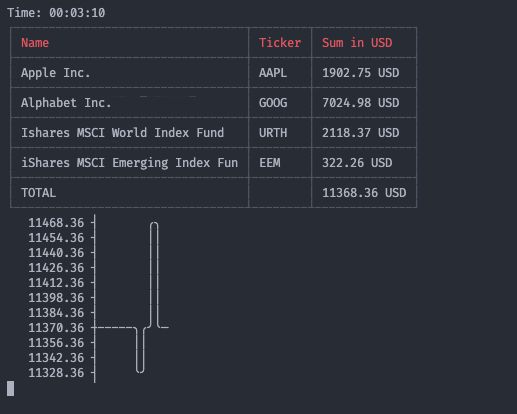

# Terminal stocks observer

The idea of the tool is to monitor the own sum of shares in the terminal.

## Usage

- `yarn`
- `yarn build`
- `node build/index.js -c exampleConfig.csv -t 60 -l exampleLogs.csv`

The result looks like this:

### Props

- [example lib in js to load google finance api](https://github.com/darthbatman/yahoo-stock-prices/blob/master/yahoo-stock-prices.js)
- used libs:
  - asciichart
  - axios
  - cli-tabl
  - command-line-arg
  - command-line-usag
